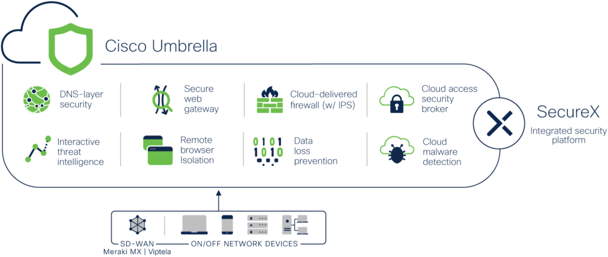

# secure-access-activity-report

[](https://developer.cisco.com/codeexchange/github/repo/vagner-instructor/fmc-remediation-module-ftd-shun)

# Cisco Umbrella Python Script for Activity Report in .CSV File

The Cisco Umbrella Python script for activity report in this repository requests an authorization token and them run a requests in the Reports API ENDPOINT for the time selected in the prompt. The following products are being used:

- Cisco Umbrella


This repository shows a simple example downloading the activity data in the Cisco Umbrella



This repository contains a small python code [example workflow](./code/cisco-umbrella-report.py). 

First - The python requests CLIENT ID and CLIENT SECRET

Second - It tests the credentials and replies if it's incorrect

Third - It requests YEAR MONTH DAY(s)

Forth - It runs downloading the data to a .CSV file


The time varies depending the customer's environment


## Installation

Clone the repo
```bash
git clone https://github.com/vagner-instructor/secure-umbrella-report.git
```

Go to your project folder
```bash
cd secure-umbrella-report
```

### Pre-requisites

Umbrella CLIENT ID and CLIENT SECRET

Period needed for the report

. Python libs:

requests

time

csv

calendar


## How to test the remediation module

Run the script
```bash
python3.13 cisco-umbrella-report.py
```

Reply the questions as prompted

Example CSV Output
 
Here is an example of the data generated in the .csv file:

```bash
year,month,day,hour,timestamp,eventTime,identityLabel,internalIp,externalIp,destination,action,categories,eventType,protocol,queryType,responseCode,url,fullEvent
,,,,,,,,,,,"Software/Technology, Infrastructure and Content Delivery Networks, SaaS and B2B, Application",,,,,,"{'returncode': 0, 'externalip': 'XXX.XXX.XXX.XXX', 'allapplications': [{'id': XXXXX, 'label': 'ThousandEyes', 'category': {'id': XX, 'label': 'IT Service Management'}}], 'date': 'ANON_DATE', 'internalip': 'XXX.XXX.XXX.XXX', 'destinationcountries': [], 'rule': {'id': None, 'label': 'UNKNOWN'}, 'time': 'ANON_TIME', 'querytype': 'A', 'policycategories': [], 'type': 'dns', 'destinationcontinents': [], 'categories': [{'id': XX, 'type': 'content', 'label': 'Software/Technology', 'integration': False, 'deprecated': True}, {'id': XXX, 'type': 'content', 'label': 'Infrastructure and Content Delivery Networks', 'integration': False, 'deprecated': False}, {'id': XXX, 'type': 'content', 'label': 'SaaS and B2B', 'integration': False, 'deprecated': False}, {'id': XXX, 'type': 'application', 'label': 'Application', 'integration': False, 'deprecated': False}], 'verdict': 'allowed', 'device': {'id': None}, 'domain': 'data.eb.us1.thousandeyes.com', 'timestamp': ANON_TIMESTAMP, 'blockedapplications': [], 'allowedapplications': [], 'identities': [{'id': XXXXXXXXX, 'type': {'id': XX, 'type': 'anyconnect', 'label': 'Anyconnect Roaming Client'}, 'label': 'anon-label', 'deleted': False}], 'threats': []}"
,,,,,,,,,,,"Software/Technology, Infrastructure and Content Delivery Networks, SaaS and B2B, Application",,,,,,"{'returncode': 0, 'externalip': 'XXX.XXX.XXX.XXX', 'allapplications': [{'id': XXXXX, 'label': 'ThousandEyes', 'category': {'id': XX, 'label': 'IT Service Management'}}], 'date': 'ANON_DATE', 'internalip': 'XXX.XXX.XXX.XXX', 'destinationcountries': [], 'rule': {'id': None, 'label': 'UNKNOWN'}, 'time': 'ANON_TIME', 'querytype': 'A', 'policycategories': [], 'type': 'dns', 'destinationcontinents': [], 'categories': [{'id': XX, 'type': 'content', 'label': 'Software/Technology', 'integration': False, 'deprecated': True}, {'id': XXX, 'type': 'content', 'label': 'Infrastructure and Content Delivery Networks', 'integration': False, 'deprecated': False}, {'id': XXX, 'type': 'content', 'label': 'SaaS and B2B', 'integration': False, 'deprecated': False}, {'id': XXX, 'type': 'application', 'label': 'Application', 'integration': False, 'deprecated': False}], 'verdict': 'allowed', 'device': {'id': None}, 'domain': 'data.eb.us1.thousandeyes.com', 'timestamp': ANON_TIMESTAMP, 'blockedapplications': [], 'allowedapplications': [], 'identities': [{'id': XXXXXXXXX, 'type': {'id': XX, 'type': 'anyconnect', 'label': 'Anyconnect Roaming Client'}, 'label': 'anon-label', 'deleted': False}], 'threats': []}"
,,,,,,,,,,,"Business Services, Infrastructure and Content Delivery Networks, Application, Business and Industry",,,,,,"{'returncode': 0, 'externalip': 'XXX.XXX.XXX.XXX', 'allapplications': [{'id': XXXXXX, 'label': 'Windows Azure CDN', 'category': {'id': X, 'label': 'Content Delivery Network'}}], 'date': 'ANON_DATE', 'internalip': 'XXX.XXX.XXX.XXX', 'destinationcountries': [], 'rule': {'id': None, 'label': 'UNKNOWN'}, 'time': 'ANON_TIME', 'querytype': 'A', 'policycategories': [], 'type': 'dns', 'destinationcontinents': [], 'categories': [{'id': XX, 'type': 'content', 'label': 'Business Services', 'integration': False, 'deprecated': True}, {'id': XXX, 'type': 'content', 'label': 'Infrastructure and Content Delivery Networks', 'integration': False, 'deprecated': False}, {'id': XXX, 'type': 'application', 'label': 'Application', 'integration': False, 'deprecated': False}, {'id': XXX, 'type': 'content', 'label': 'Business and Industry', 'integration': False, 'deprecated': False}], 'verdict': 'allowed', 'device': {'id': None}, 'domain': 'edgeassetservice.azureedge.net', 'timestamp': ANON_TIMESTAMP, 'blockedapplications': [], 'allowedapplications': [], 'identities': [{'id': XXXXXXXXX, 'type': {'id': XX, 'type': 'anyconnect', 'label': 'Anyconnect Roaming Client'}, 'label': 'anon-label', 'deleted': False}], 'threats': []}"
,,,,,,,,,,,"Software/Technology, Business Services, Infrastructure and Content Delivery Networks, Application, Computers and Internet",,,,,,"{'returncode': 0, 'externalip': 'XXX.XXX.XXX.XXX', 'allapplications': [], 'date': 'ANON_DATE', 'internalip': 'XXX.XXX.XXX.XXX', 'destinationcountries': [], 'rule': {'id': None, 'label': 'UNKNOWN'}, 'time': 'ANON_TIME', 'querytype': 'A', 'policycategories': [], 'type': 'dns', 'destinationcontinents': [], 'categories': [{'id': XX, 'type': 'content', 'label': 'Software/Technology', 'integration': False, 'deprecated': True}, {'id': XX, 'type': 'content', 'label': 'Business Services', 'integration': False, 'deprecated': True}, {'id': XXX, 'type': 'content', 'label': 'Infrastructure and Content Delivery Networks', 'integration': False, 'deprecated': False}, {'id': XXX, 'type': 'application', 'label': 'Application', 'integration': False, 'deprecated': False}, {'id': XXX, 'type': 'content', 'label': 'Computers and Internet', 'integration': False, 'deprecated': False}], 'verdict': 'allowed', 'device': {'id': None}, 'domain': 'edge.microsoft.com', 'timestamp': ANON_TIMESTAMP, 'blockedapplications': [], 'allowedapplications': [], 'identities': [{'id': XXXXXXXXX, 'type': {'id': XX, 'type': 'anyconnect', 'label': 'Anyconnect Roaming Client'}, 'label': 'anon-label', 'deleted': False}], 'threats': []}"
,,,,,,,,,,,"Software/Technology, Business Services, Application, Business and Industry, Computers and Internet",,,,,,"{'returncode': 0, 'externalip': 'XXX.XXX.XXX.XXX', 'allapplications': [{'id': XXXXXX, 'label': 'Windows Diagnostics Data', 'category': {'id': XX, 'label': 'IT Service Management'}}], 'date': 'ANON_DATE', 'internalip': 'XXX.XXX.XXX.XXX', 'destinationcountries': [], 'rule': {'id': None, 'label': 'UNKNOWN'}, 'time': 'ANON_TIME', 'querytype': 'A', 'policycategories': [], 'type': 'dns', 'destinationcontinents': [], 'categories': [{'id': XX, 'type': 'content', 'label': 'Software/Technology', 'integration': False, 'deprecated': True}, {'id': XX, 'type': 'content', 'label': 'Business Services', 'integration': False, 'deprecated': True}, {'id': XXX, 'type': 'application', 'label': 'Application', 'integration': False, 'deprecated': False}, {'id': XXX, 'type': 'content', 'label': 'Business and Industry', 'integration': False, 'deprecated': False}, {'id': XXX, 'type': 'content', 'label': 'Computers and Internet', 'integration': False, 'deprecated': False}], 'verdict': 'allowed', 'device': {'id': None}, 'domain': 'v10.events.data.microsoft.com', 'timestamp': ANON_TIMESTAMP}"
```

## References

* [Cisco Umbrella API Documentation]([https://docs.umbrella.com/umbrella-user-guide/](https://docs.umbrella.com/umbrella-user-guide/))


### DevNet Sandbox

https://devnetsandbox.cisco.com/DevNet/catalog/cisco-umbrella

## Caveats

Please note that the script provided in this repository is a sample module.
Although it provides a minimum viable module that provides the functionality as described above,
it is not ready for use in a production network.

Additional development would be required to meet necessary functional and non-functional
requirements for any customer environment before the module can be used in a production network.

## Getting help

If you have questions, concerns, bug reports, vulnerability, etc., please create an issue against this repository.

## Author(s)

This project was written and is maintained by the following individual(s):

* Vagner Silva

## OpenSSF Best Practices
[](https://www.bestpractices.dev/projects/9715)


## Credit(s)

* Victor Azevedo 


